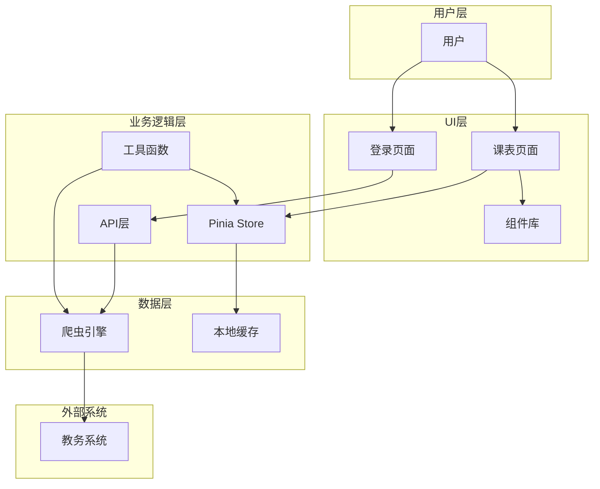
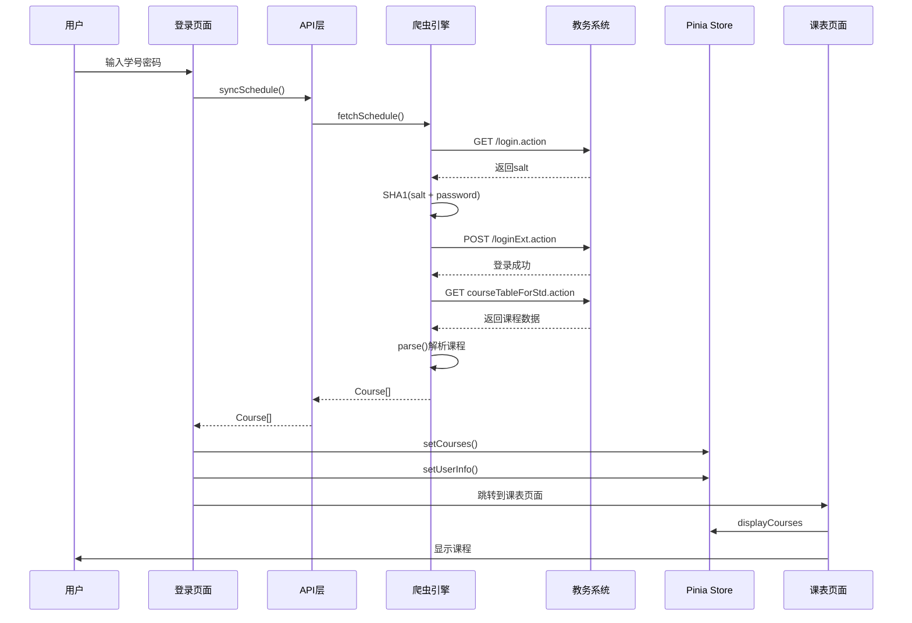
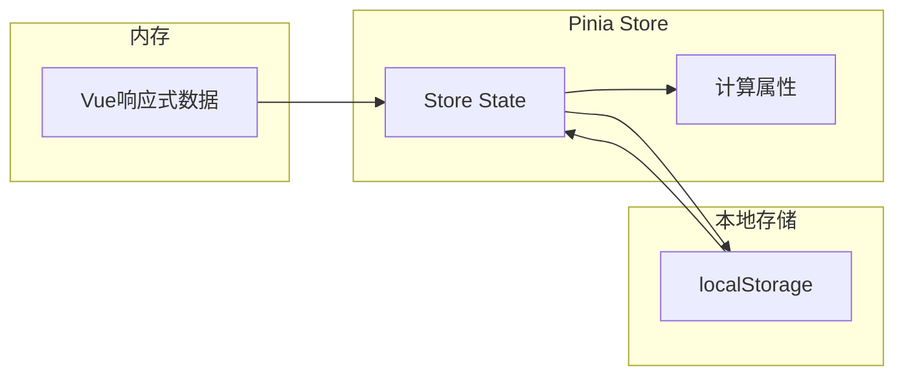
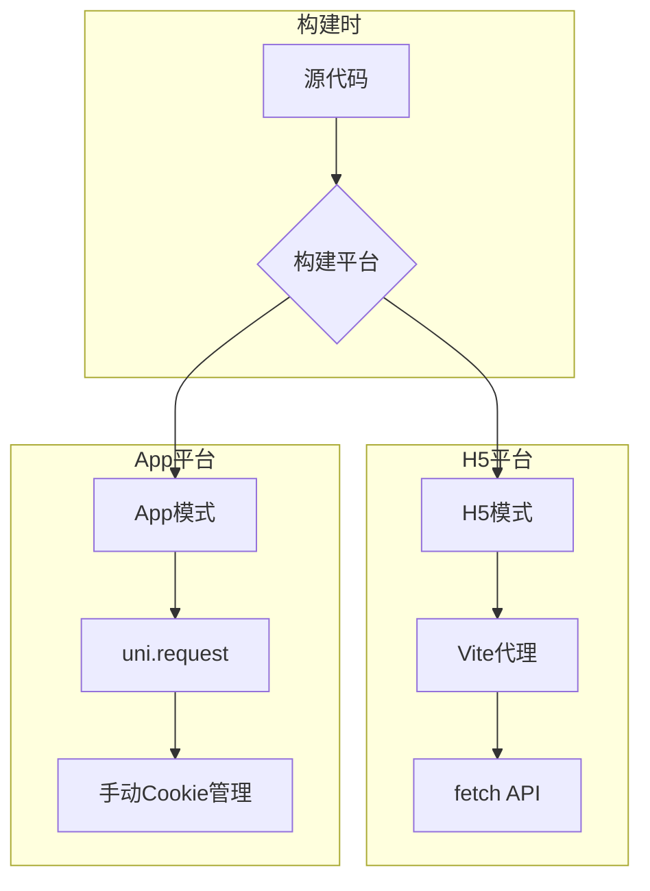
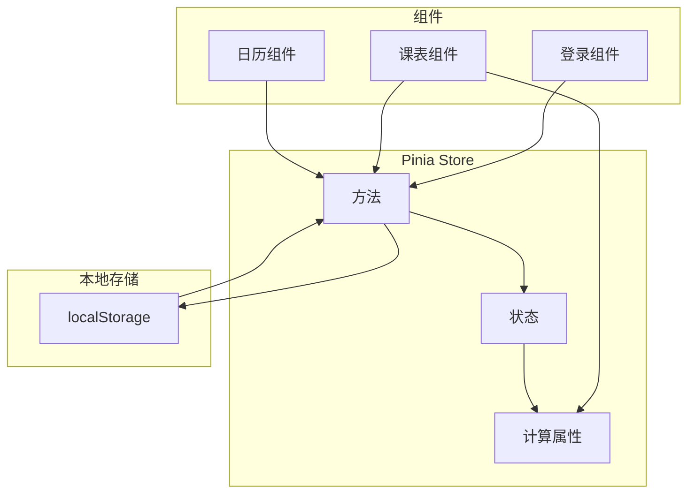

# 架构设计和数据流图

> 西亚斯课表助手的整体架构设计、数据流向和平台适配说明

## 📋 目录

- [整体架构图](#整体架构图)
- [数据流图](#数据流图)
- [平台适配流程图](#平台适配流程图)
- [爬虫流程图](#爬虫流程图)
- [状态管理流程图](#状态管理流程图)
- [架构设计原则](#架构设计原则)
- [模块职责说明](#模块职责说明)

## 整体架构图



## 数据流图

### 核心数据流



### 数据持久化流程



## 平台适配流程图



### 平台差异说明

| 特性 | H5模式 | App模式 |
|------|--------|---------|
| HTTP客户端 | fetch() | uni.request |
| Cookie管理 | 浏览器自动管理 | 手动CookieJar |
| CORS处理 | Vite代理 | 直连 |
| Referer/Origin | 代理重写 | 可手动设置 |
| 更新检测 | 跳过 | 支持APK/WGT |

## 爬虫流程图

```mermaid
graph TD
    Start[开始] --> PreLogout[预注销旧session]
    PreLogout --> GetSalt[GET /login.action]
    GetSalt --> CheckSalt{获取salt成功?}
    CheckSalt -->|否| Error[登录失败]
    CheckSalt -->|是| HashPwd[SHA1加密密码]
    HashPwd --> PostLogin[POST /loginExt.action]
    PostLogin --> CheckLogin{登录成功?}
    CheckLogin -->|否| Error
    CheckLogin -->|是| GetShell[GET courseTableForStd.action]
    GetShell --> ParseShell[解析shell页面]
    ParseShell --> GetInner[GET内部页面]
    GetInner --> ParseInner[解析内部页面]
    ParseInner --> CheckUser{获取userId?}
    CheckUser -->|否| Fallback[尝试学籍页]
    Fallback --> ParseDetail[解析学籍页]
    ParseDetail --> CheckUser
    CheckUser -->|是| GetSemester{获取semesterId?}
    GetSemester -->|否| Error
    GetSemester -->|是| PostData[POST课程数据]
    PostData --> Parse[解析TaskActivity]
    Parse --> Return[返回Course[]]
```

## 状态管理流程图



### 状态流转说明

1. **登录阶段**
   - 用户输入 → `syncSchedule()` → `setCourses()` → `setUserInfo()`
   - 数据同时保存到localStorage

2. **显示阶段**
   - `loadFromCache()` 从localStorage加载数据
   - `initCurrentWeek()` 根据学期开始日期计算当前周
   - `displayCourses` 计算属性过滤并渲染课程

3. **交互阶段**
   - 用户切换周次 → `setCurrentWeek()`
   - 用户修改学期开始日期 → `setSemesterStart()`
   - 用户退出登录 → `clearData()` 或 `clearUserData()`

## 架构设计原则

### 1. 单一职责原则 (SRP)
- **API层**：只负责封装爬虫调用和错误翻译
- **Store层**：只负责状态管理和数据持久化
- **Utils层**：只负责工具函数和业务逻辑
- **Components**：只负责UI渲染和用户交互

### 2. 依赖倒置原则 (DIP)
- 组件依赖Store抽象，不依赖具体实现
- Store依赖工具函数接口，不依赖具体爬虫

### 3. 开闭原则 (OCP)
- 主题系统通过配置扩展，无需修改代码
- 爬虫支持扩展其他教务系统

### 4. 最小知识原则 (LoD)
- 组件只访问Store，不直接访问爬虫或缓存
- Store封装所有数据访问细节

## 模块职责说明

### 1. API层 (`api/schedule.ts`)
- **职责**：封装爬虫调用，提供统一接口
- **依赖**：crawler.ts, types
- **导出**：syncSchedule()

### 2. Store层 (`stores/schedule.ts`)
- **职责**：状态管理，数据持久化
- **依赖**：utils/schedule.ts, config/schedule.ts
- **导出**：useScheduleStore

### 3. 爬虫引擎 (`utils/crawler.ts`)
- **职责**：登录教务系统，抓取课表数据
- **依赖**：crypto-js, types
- **导出**：fetchSchedule(), translateError(), SiasCrawler

### 4. 渲染工具 (`utils/schedule.ts`)
- **职责**：课程过滤、颜色分配、时间解析
- **依赖**：config/themes.ts, types
- **导出**：getCourseColor(), parseNodes(), filterByWeek(), toRenderCourses(), getDayName(), getNodeTimeRange()

### 5. 组件层 (`components/`)
- **职责**：UI渲染，用户交互
- **依赖**：Store, Utils
- **导出**：CourseDetailModal, CustomCalendar, WeekSelector

## 技术选型说明

### 选择Vue 3 + Composition API
- 更好的TypeScript支持
- 更灵活的逻辑复用
- 更小的打包体积

### 选择Pinia (而非Vuex)
- 更好的TypeScript支持
- 更简洁的API
- 更好的DevTools支持

### 选择Uni-app
- 一套代码多端运行
- 原生性能体验
- 丰富的组件库

### 选择自研爬虫 (而非后端API)
- 零服务器成本
- 用户隐私保护
- 无网络依赖
